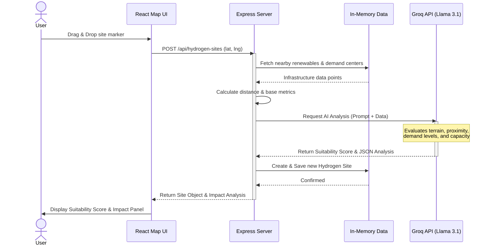

# 🌍 Green Hydrogen InfraVision

*Play, Plan, and Prove Impact*

🚀 **Live Demo:** [https://infravisionh2.onrender.com/](https://infravisionh2.onrender.com/)

📱 **Mobile App:** The project also has an APK for mobile devices.

---

## 🔹 Project Description

**Problem:**  
Planning and expanding green hydrogen infrastructure is complex. Urban planners, energy companies, and policymakers often lack interactive tools that combine mapping, AI insights, and impact analysis for optimal decision-making.

**Our Solution:**  
**Green Hydrogen InfraVision** is an interactive, gamified, AI-powered platform for **mapping, optimizing, and analyzing green hydrogen infrastructure**. Users can explore existing and planned hydrogen assets, experiment with site placement, and visualize sustainability impacts in real-time.

---

## 🛠 Key Features

### 🌐 Interactive Map
* OpenStreetMap integration with multiple layers:
  - Street Map, Satellite, Terrain, Dark Mode
  - Existing H₂ Plants
  - Renewable Sources
  - Demand Centers
  - Pipeline Network
  - Regulatory Zones
  - AI Suggested Sites
* Drag & drop site markers
* Real-time **Site Assessment & Suitability Analysis**

### 🎮 Gamified Optimization
* AI-suggested site highlights
* Left panel with **AI suggestion plans**
* Click to jump to suggested location
* Scoring for site suitability and sustainability impact

### 🤖 AI-Powered Site Analysis
* Powered by **Groq API** (Llama 3.1)
* Automatically evaluates dropped locations based on proximity to renewable energy and demand centers
* Provides detailed recommendations and dynamic suitability scores

### 💬 AI Chatbot Assistant
* Integrated expert chatbot specialized in India's green hydrogen infrastructure
* Ask questions about government policies, real-world projects, and suitability scoring
* Powered by **Groq API** (Llama 3.1) for fast and contextual responses

### 📊 Dashboard & Analysis
* Plants Dashboard with metrics
* Suitability & impact analysis charts
* CO₂ saved, industries supported, renewable utilization
* Export images & share button for quick access

### 📍 Drag & Explore Any Location
* Drag anywhere on the map
* Access Site Assessment details: terrain, infrastructure proximity, land availability
* Check Impact Metrics: CO₂ saved, industries supported, renewable utilization
* Overall Score: provides a single metric summarizing site viability and planning potential

### 🌙 Other Features
* Dark/Light mode toggle
* Fully local, in-memory data store with seeded infrastructure data
* Help form for support
* About page explaining the project

---

## 🎯 Demo Flow

1. Open the map → explore hydrogen assets & renewable hubs.
2. See AI-suggested sites → top recommendations glow.
3. Drag & drop your own plant → get suitability score & analysis.
4. Open the dashboard → view CO₂ savings, industries supported, renewables usage.
5. Export & share → quick access for presentations and reports.

---

## 👥 Users

* Urban & Regional Planners 🏙  
* Energy Companies ⚡  
* Project Developers 🏗  
* Policy Analysts 📑  

---

## 🌱 Impact

* **Capital Efficiency** → directs investments to high-impact projects  
* **Avoids Redundancy** → prevents overlapping infrastructure  
* **Supports Net-Zero Goals** → measurable CO₂ savings  
* **Drives Coordination** → enables ecosystem-wide growth  

---

## 🧰 Tech Stack

### Frontend
* React + TypeScript  
* TailwindCSS  
* Leaflet.js Maps  

### Backend
* Node.js + Express  
* In-Memory Data Storage (No database setup required)
* Groq API (Llama 3.1) for AI analysis  

### Map Integration
* Leaflet.js Maps  
* OpenStreetMap (OSM)  

---

## 🔄 System Architecture & Flow

The following sequence diagram illustrates the core process of how the application calculates and creates a new AI-scored hydrogen site.

---

## 🖥 Navbar & Pages

* **Dashboard** → Main map, AI suggestions, plants dashboard, drag & drop, site assessment  
* **About** → Project description, team, impact  
* **Help** → Support form  

---

## 👥 Team NPHard

* **Leader:** Patel Priyank  
* Patel Yug  
* Patel Prince  
* Maalav Patadiya  

---

## 📌 Next Steps

* Expand dataset → integrate real-world renewable & hydrogen infrastructure data  
* Enhance AI → geospatial ML models for smarter site selection  
* Advanced gamification → scoring leaderboard  
* Public API → enable external tools & researchers  

---

## 💡 Inspiration

Built during a hackathon, **InfraVision** merges energy planning, AI, and gamification into an **engaging, decision-support platform**. It is designed to be more than a prototype—a **vision for the future hydrogen economy**.  

---

## 📄 License

MIT License – free to use, modify, and distribute.

---

## 🙏 Thank You

Thank you for exploring **Green Hydrogen InfraVision**. Together, let's accelerate the green hydrogen revolution!
